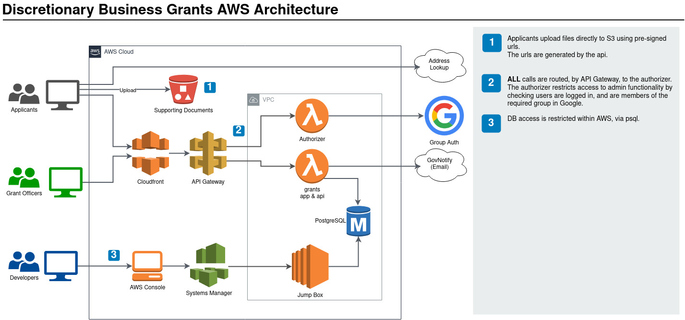
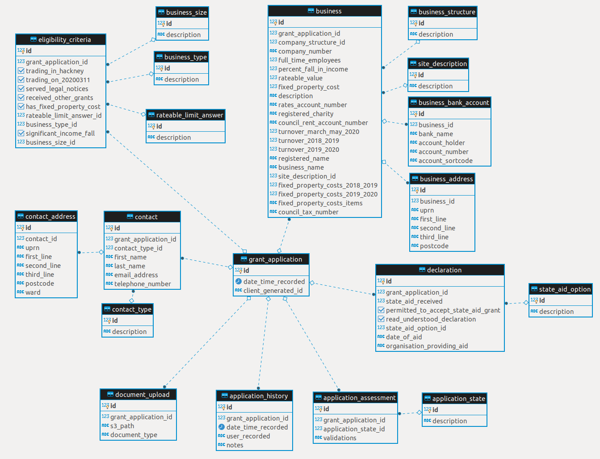

# Discretionary Business Grants

This application was developed, for [Hackney Council](https://hackney.gov.uk/), to allow small businesses to apply for discretionary support grants during the 2020 coronavirus (COVID-19) pandemic.

It consists of a, publicly available, front end for applicants and a restricted back end for Grant Administrators to process claims.

## AWS Architecture


[Editable Diagram Source](dbg-aws.drawio)

## Database

The database engine is [PostgreSQL](https://www.postgresql.org/), version 11 in AWS RDS.



## Known Issues

### Api and Front end application submission blocking

Application submissions were closed at 2020-06-26T23:00:00.000Z. The front end reads an env var to enable this. The back end API blocks new submissions in `pages/api/applications/index.js`. In the event that applications are re-enabled, the back end should read the same environment variable.

### Mimetypes on s3 files

If the application is re-enabled - when users upload supporting documents they will be stored in S3 with the wrong mime type set. See [here](https://github.com/LBHackney-IT/discretionary-business-grants/blob/master/docs/S3-METADATA.md) for a complete description and fix.

## Technology

This is a [Next.js](https://nextjs.org/) project bootstrapped with [`create-next-app`](https://github.com/zeit/next.js/tree/canary/packages/create-next-app).

## Getting Started

The app needs Node 12, if you have [NVM](https://github.com/nvm-sh/nvm) installed just run `nvm use` in your terminal.

Install the dependencies:

    yarn install

Create your `.env` file from `.env.sample`. You will need to grab some secrets from (TBC, it's not clear at the time of writing, but you can view the environment variables on the Lambda if it is already running).

So that the auth token from using Staging/Production can work with your local dev environment and you will be able to access the admin section etc., add the following to your `/etc/hosts` file...

    127.0.0.1       dev.discretionarybusinessgrants.hackney.gov.uk

Run the development server:

    yarn dev

Open [http://localhost:3000](http://localhost:3000) with your browser to see the result.

You can start editing the page by modifying `pages/index.js`. The page auto-updates as you edit the file.

## Learn More

To learn more about Next.js, take a look at the following resources:

- [Next.js Documentation](https://nextjs.org/docs) - learn about Next.js features and API.
- [Learn Next.js](https://nextjs.org/learn) - an interactive Next.js tutorial.

You can check out [the Next.js GitHub repository](https://github.com/zeit/next.js/) - your feedback and contributions are welcome!

#### Setup the database

1. Create the database:
   ```bash
   createdb dbg
   ```
2. Add the database URL as an environment variable in `.env`. On Linux you may need to provide a username and password.

```bash
cat <<<EOF >> .env
DATABASE_URL=postgresql://localhost/dbg
EOF
```

3. Run all migrations
   ```bash
   npm run dbmigrate up
   ```

#### Seeding the local database

To seed your database with data to get going quickly, you can run the file under `db/seeds.sql` by doing the following:

```bash
cat db/seeds.sql | psql dbg
```

## Applying database migrations

Database migrations are managed with [db-migrate](https://github.com/db-migrate/node-db-migrate). To create a new migration

```bash
npm run dbmigrate create description-for-your-migration
```

This will create an up and down migration as sql files in `db/migrations/sqls` as well as a javascript file in `db/migrations` to run the sql files.

Migrations are run with

```bash
npm run dbmigrate up
```

Migrations can be rolled back with

```bash
npm run dbmigrate down
```

You can do a dry-run to view the changes that will be applied without making any changes (for both up and down migrations)

```bash
npm run dbmigratedry up
```

## Staging/Production database migrations and seeding

To run database migrations against the RDS databases on AWS you need to run the dbmigrate up command via AWS System Manager.

1. Log into the AWS account
2. Go to System Manager
3. Go to Session Manager
4. Click 'Start Session'
5. Select an instance (there should only be 1)
6. Click 'Start Session' - This should open up a terminal like window in your browser
7. Run `cd ~/discretionary-business-grants/ && git pull && npm run dbmigrate up`

To seed the AWS database start as session as above and then run:
`cd ~/discretionary-business-grants/ && source ./.env && cat db/seeds.sql | psql $DATABASE_URL`

## Staging/Production PostgresSQL command line access

Start a Session Manager session as above, then...

```bash
psql $DATABASE_URL
```

## Staging/Production RDS Jump Box Setup

Currently this is created manually, which is not ideal. We could perhaps look at triggering a Lambda function to run the migrations, but that would not give us command line access to administer the database, so perhaps the Jump Box is best, in which case it should really be created with code (Terraform or CloudFormation), but in the meantime, these are the steps to recreate it manually.

- Create a new EC2 instance
  - Amazon Linux 2 AMI
  - t2.micro
  - same region/availability zone/subnet as the RDS database
  - The poorly named “bastion_profile“ role which has the correct Systems manager policy etc. and will come out the other end as "instance_role"
  - "Access to Postgres" security group
  - SessionManagerKey
  - Name “RDS Jump Box - Discretionary Business Grants"
- Then you probably need to add it to Systems Manager
  - Go to AWS Systems Manager Quick Setup
  - Client "Edit all"
  - Scroll to bottom and select "CChoose all instances in the current AWS account and Region"
  - Click "Reset" and wait for the magic to happen
- Configure the instance
  - Start a new session via Systems Manager > Session Manager
  - Create SSH key mkdir ~/.ssh && cd ~/.ssh ssh-keygen -t rsa -b 4096 -C "database-migrations-<environment>@jumpbox-<instance_id>" cat ~/.ssh/id_rsa.pub
  - Add SSH key as a deployment key on the repository
  - Install Git sudo yum install git
  - Install Node.js 12 sudo curl -sL https://rpm.nodesource.com/setup_12.x | bash - sudo yum install -y nodejs
  - Clone the repository cd ~ && git clone git@github.com:LBHackney-IT/discretionary-business-grants.git
  - Install dependencies cd ~/discretionary-business-grants && npm install
  - echo "export DATABASE_URL=postgres://<username>:<password>@<endpoint>:<port>/discretionaryBusinessGrantsDb" >> ~/.bashrc && \ source ~/.bashrc You can get the database details from the Lambda environment variables
  - Install PostgreSQL so we can use the client sudo amazon-linux-extras install postgresql11
